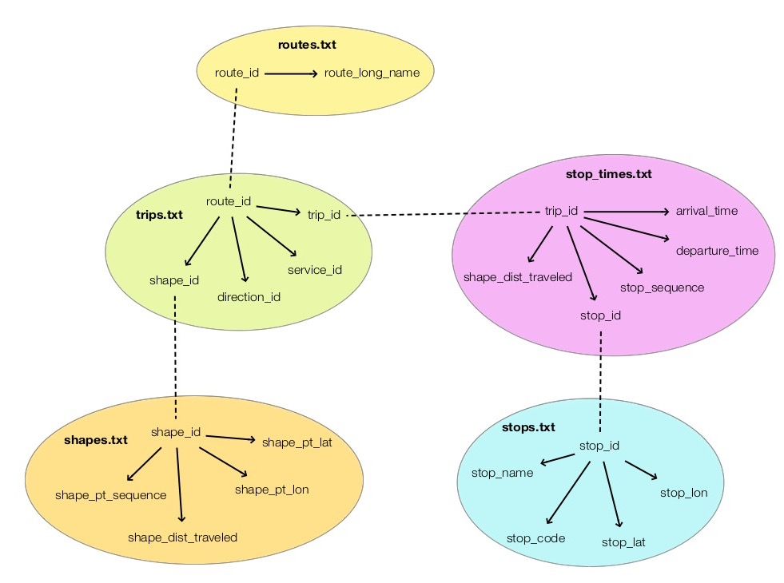
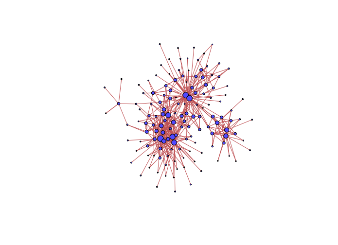

# TfNSW

Explore the [TfNSW](https://opendata.transport.nsw.gov.au) GTFS dataset of public transport routes at https://opendata.transport.nsw.gov.au/dataset/timetables-complete-gtfs.

The main GTFS data fields are linked across the tables according to my diagram below.

## Sample output

This is a graph of all the endpoints and the unique trips between them.

